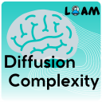
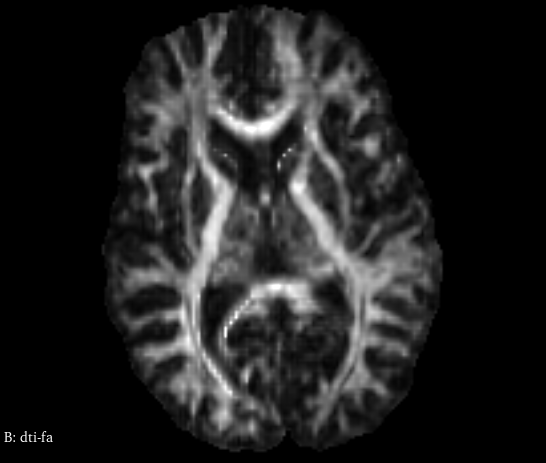
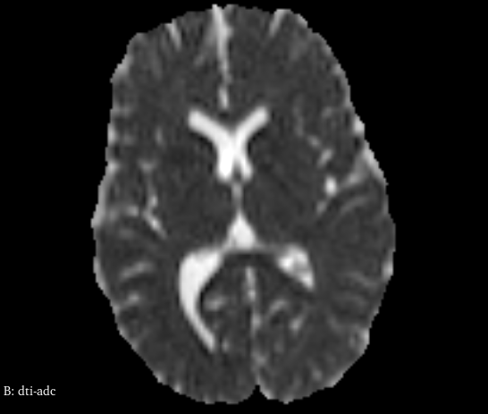
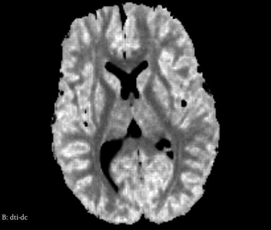

# Diffusion Complexity Mapping

{ width="250" .center}

Welcome to the Diffusion Complexity Mapping!

This 3D Slicer extension was designed to assist users in processing Diffusion Tensor Imaging (DTI) for the `Diffusion Complexity` mapping (`dc`). 

The full documentation of the usage, implementation and updates in the `dc` map is given in this repository and posted online using a [web-based host](https://slicerdiffusioncomplexitymap.readthedocs.io/en/latest/). 

## Output examples

The `Diffusion Complexity` extension is a simple way to collect the `dc` map using a GUI interface. The images below represents some examples in comparison with the classical FA and ADC maps for DTI images:

{ width="300" .center}
A FA map example

{ width="300" .center}
A ADC map example

{ width="300" .center}
A DC map example

## Modules

### Diffusion Complexity map

This module is able to reconstruct the `Diffusion Complexity`  map from a standard Diffusion-Weighted MRI imaging acquisition.

## Cite this tool

We hope that the `Diffusion Complexity` can be helpful for your applications. If possible, recall to cite at least one of the following publications:

* da S. Senra Filho, A., Murta Junior, L. & Monteiro Paschoal, A. Assessing biological self-organization patterns using statistical complexity characteristics: a tool for diffusion tensor imaging analysis. Magn Reson Mater Phy (2024). [DOI link](http://dx.doi.org/10.1007/s10334-024-01185-4)

## License

This project is under MIT license and following details are given at the [LICENSE](https://github.com/CSIM-Toolkits/SlicerDiffusionComplexityMap/blob/main/LICENSE) file in the project repository.